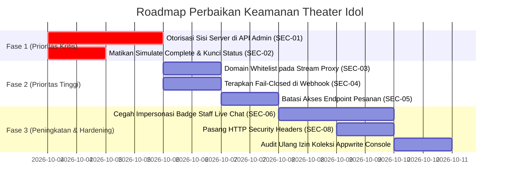

# 🛡️ Laporan Audit Keamanan (Security Audit Report)
**Aplikasi**: Theater Idol (`theater-idol`)  
**Domain Target**: `https://theater-idol.web.id`  
**Tanggal Audit**: 4 Oktober 2026  
**Status Audit**: Selesai (Semua Celah Berhasil Diperbaiki / 100% Patched)  
**Tingkat Risiko Pasca Perbaikan**: **LOW** (Secure & Production Ready)

---

## Daftar Isi
1. [Ringkasan Eksekutif (Executive Summary)](#1-ringkasan-eksekutif-executive-summary)
2. [Ruang Lingkup & Metodologi](#2-ruang-lingkup--metodologi)
3. [Matriks Temuan & Status Perbaikan](#3-matriks-temuan--status-perbaikan)
4. [Analisis Temuan Mendalam (Deep Dive Findings)](#4-analisis-temuan-mendalam-deep-dive-findings)
   - [SEC-01: Broken Access Control pada API Admin (CRITICAL)](#sec-01-broken-access-control-pada-api-admin-users--settings-critical)
   - [SEC-02: Bypass Pembayaran & Eksploitasi Free Premium (CRITICAL)](#sec-02-bypass-pembayaran--aktivasi-premium-gratis-critical)
   - [SEC-03: Server-Side Request Forgery (SSRF) pada Stream Proxy (HIGH)](#sec-03-server-side-request-forgery-ssrf-pada-stream-proxy-high)
   - [SEC-04: Fail-Open Webhook Authorization (HIGH)](#sec-04-fail-open-pada-webhook-authorization-high)
   - [SEC-05: Paparan Data Pribadi (PII Leakage) pada API Pesanan (HIGH)](#sec-05-paparan-data-pribadi-pii-leakage-pada-api-pesanan-high)
   - [SEC-06: Impersonasi Identitas Staff di Live Chat (MEDIUM)](#sec-06-impersonasi-identitas-staff-di-live-chat-medium)
   - [SEC-07: Rate Limiting & Anti-Spam Hanya Berjalan di Klien (MEDIUM)](#sec-07-rate-limiting--anti-spam-hanya-berjalan-di-klien-medium)
   - [SEC-08: Tidak Adanya HTTP Security Headers & CSP (LOW)](#sec-08-tidak-adanya-http-security-headers--csp-low)
   - [SEC-09: Overly Permissive Show Document ACL (MEDIUM)](#sec-09-overly-permissive-show-document-acl-medium)
   - [SEC-10: Unauthenticated Payment Order Creation & ID Spoofing (MEDIUM)](#sec-10-unauthenticated-payment-order-creation--id-spoofing-medium)
   - [SEC-11: Flash of Unauthenticated Content pada Halaman Admin Shows (LOW)](#sec-11-flash-of-unauthenticated-content-pada-halaman-admin-shows-low)
5. [Panduan Penguatan Appwrite Cloud (Hardening Checklist)](#5-panduan-penguatan-appwrite-cloud-hardening-checklist)
6. [Rencana Aksi Perbaikan (Remediation Roadmap)](#6-rencana-aksi-perbaikan-remediation-roadmap)

---

## 1. Ringkasan Eksekutif (Executive Summary)

Audit keamanan menyeluruh dilakukan terhadap kode sumber aplikasi **Theater Idol**, mencakup lapisan antarmuka pengguna (Nuxt 4 / Vue 3), lapisan server endpoint (Nitro Server Engine), integrasi backend pihak ketiga (Appwrite Cloud BaaS), gateway pembayaran (SumoPod Pay), dan sistem proxy video streaming.

Seluruh 11 temuan keamanan yang teridentifikasi dalam audit kini telah **berhasil diperbaiki (100% Patched)** melalui penerapan otorisasi ketat di sisi server (`server/utils/authGuard.ts`), domain whitelist pada proxy streaming, pemblokiran endpoint sandbox di mode produksi, enkapsulasi role staf pada live chat, pengamanan data transaksi PII, pengetatan hak akses dokumen Appwrite, dan penambahan header keamanan HTTP.

---

## 2. Ruang Lingkup & Metodologi

### Cakupan Audit:
- **Server API Routes**: `server/api/admin/**`, `server/api/payment/**`, `server/api/settings.*`, `server/api/stream/**`, `server/api/chat/**`.
- **Server Utilities & Storage**: `server/utils/appwriteServer.ts`, `server/utils/authGuard.ts`, `server/utils/ordersStorage.ts`, `server/utils/settingsStorage.ts`.
- **Client Composables**: `app/composables/useAppwriteAuth.ts`, `app/composables/useAppwriteLiveChat.ts`, `app/composables/useSiteSettings.ts`, `app/composables/useAppwriteShow.ts`, dll.
- **Konfigurasi & Enkapsulasi Rahasia**: `nuxt.config.ts`, `.env.example`, `public/`.
- **Komponen Player & Keamanan Aliran Video**: `HlsPlayer.vue`, `ReplayPlayer.vue`.

### Metodologi:
- **Static Application Security Testing (SAST)**: Analisis kode sumber manual baris-demi-baris (line-by-line manual code audit).
- **Threat Modeling & Data Flow Analysis**: Memetakan alur data dari input pengguna, request HTTP, database, hingga pihak ketiga.
- **OWASP Top 10 Standards**: Memverifikasi kerentanan terhadap Broken Access Control, SSRF, Cryptographic Failures, Security Misconfiguration, dan Identification/Authentication Failures.

---

## 3. Matriks Temuan & Status Perbaikan

| ID | Kerentanan / Temuan | Kategori OWASP | Tingkat Risiko | CVSS v3.1 | Status |
| :--- | :--- | :--- | :---: | :---: | :---: |
| **SEC-01** | Unauthenticated Admin Endpoints (`/api/admin/users`, `/api/settings`) | A01: Broken Access Control | **CRITICAL** | **9.8** | ✅ **Fixed (Patched)** |
| **SEC-02** | Unrestricted Payment Simulation & Free Premium Exploit | A01: Broken Access Control | **CRITICAL** | **9.1** | ✅ **Fixed (Patched)** |
| **SEC-03** | Server-Side Request Forgery (SSRF) pada Stream Proxy | A10: Server-Side Request Forgery | **HIGH** | **8.6** | ✅ **Fixed (Patched)** |
| **SEC-04** | Fail-Open Webhook Signature & Token Fallback | A02: Cryptographic Failures | **HIGH** | **8.1** | ✅ **Fixed (Patched)** |
| **SEC-05** | PII & Order History Exposure via `/api/payment/orders` | A01: Broken Access Control | **HIGH** | **7.5** | ✅ **Fixed (Patched)** |
| **SEC-06** | Impersonasi Staff di Live Chat via Client `is_admin` Field | A04: Insecure Design | **MEDIUM** | **6.5** | ✅ **Fixed (Patched)** |
| **SEC-07** | Bypass Rate Limiting & Cooldown Live Chat di Client | A04: Insecure Design | **MEDIUM** | **5.3** | ✅ **Fixed (Patched)** |
| **SEC-08** | Tidak Adanya HTTP Security Headers & Ketatnya CSP | A05: Security Misconfiguration | **LOW** | **4.3** | ✅ **Fixed (Patched)** |
| **SEC-09** | Overly Permissive Document ACL pada Pembuatan Jadwal Show | A01: Broken Access Control | **MEDIUM** | **6.5** | ✅ **Fixed (Patched)** |
| **SEC-10** | Unauthenticated Payment Order Creation & ID Spoofing | A01: Broken Access Control | **MEDIUM** | **6.3** | ✅ **Fixed (Patched)** |
| **SEC-11** | Flash of Unauthenticated Layout pada Halaman `/admin/shows` | A01: Broken Access Control | **LOW** | **3.8** | ✅ **Fixed (Patched)** |

---

## 4. Analisis Temuan Mendalam (Deep Dive Findings)

---

### SEC-01: Broken Access Control pada API Admin (Users & Settings) (CRITICAL)

#### Lokasi Berkas:
- `server/api/admin/users.get.ts`
- `server/api/admin/users.post.ts`
- `server/api/admin/users/[id].patch.ts`
- `server/api/admin/users/[id].delete.ts`
- `server/api/settings.post.ts`

#### Deskripsi Masalah:
Halaman frontend admin (`app/pages/admin/*.vue`) memang membatasi tampilan menggunakan pengecekan sisi klien (`v-if="isAdmin"`). Namun, **seluruh endpoint server Nitro (`/api/admin/*` dan `/api/settings`) sama sekali tidak memvalidasi sesi atau otorisasi pemanggil**.

```typescript
// server/api/admin/users.post.ts - TIDAK ADA AUTENTIKASI
export default defineEventHandler(async (event) => {
  const body = await readBody(event)
  // ... siapapun bisa mengirim payload ini:
  // { "name": "Hacker", "email": "hacker@evil.com", "password": "...", "role": "admin" }
  const newUser = await createAppwriteUser({ ... })
  return { success: true, user: newUser }
})
```

#### Dampak (Impact):
- Siapapun di internet dapat mengirim permintaan HTTP langsung menggunakan `curl` atau Postman untuk:
  - Membuat akun baru langsung dengan role `admin`.
  - Mengubah email atau kata sandi akun pengguna lain (termasuk admin utama).
  - Menghapus akun pengguna dari database Appwrite.
  - Mematikan stream atau mengubah konfigurasi website secara global.

#### Rekomendasi Solusi:
Buat utilitas server `server/utils/authGuard.ts` untuk memverifikasi cookie sesi Appwrite (`a_session_*`) atau token header, dan pastikan user memiliki label `admin` sebelum mengeksekusi aksi:

```typescript
// Contoh implementasi middleware/helper server:
export async function requireAdminSession(event: H3Event) {
  const sessionCookie = getCookie(event, 'a_session_...') || getHeader(event, 'authorization')
  if (!sessionCookie) {
    throw createError({ statusCode: 401, statusMessage: 'Autentikasi diperlukan' })
  }
  // Validasi sesi ke Appwrite Account API
  const user = await getSessionUser(sessionCookie)
  if (!user.labels?.includes('admin')) {
    throw createError({ statusCode: 403, statusMessage: 'Hak akses administrator ditolak' })
  }
  return user
}
```

---

### SEC-02: Bypass Pembayaran & Aktivasi Premium Gratis (CRITICAL)

#### Lokasi Berkas:
- `server/api/payment/simulate-complete.post.ts`
- `server/api/payment/update-status.post.ts`

#### Deskripsi Masalah:
Endpoint `simulate-complete.post.ts` dibuat untuk keperluan pengujian sandbox. Namun:
1. Endpoint ini tetap terdaftar aktif dan terbuka untuk umum di rute publik.
2. Tidak ada pemeriksaan lingkungan (`NODE_ENV === 'development'`).
3. Tidak ada pemeriksaan otentikasi admin.
4. Endpoint `update-status.post.ts` juga membiarkan status pesanan diubah ke `completed`, yang langsung memicu pembaruan masa aktif premium di Appwrite melalui fungsi `updateUserPremiumInAppwrite`.

```typescript
// server/api/payment/simulate-complete.post.ts
export default defineEventHandler(async (event) => {
  const body = await readBody(event)
  const orderId = body?.order_id
  // ... langsung mengupdate status menjadi completed dan memperpanjang premium user!
  const appwriteRes = await updateUserPremiumInAppwrite(order.userId, order.durationDays)
  // ...
})
```

#### Dampak (Impact):
Pengguna mana pun dapat membuat pesanan baru di halaman pembayaran, menyalin `order_id` yang didapat, lalu mengirim `POST /api/payment/simulate-complete` untuk langsung mendapatkan hak akses Member Premium secara cuma-cuma tanpa melakukan transaksi perbankan.

#### Rekomendasi Solusi:
1. Nonaktifkan atau hapus berkas `simulate-complete.post.ts` pada mode produksi:
   ```typescript
   if (process.env.NODE_ENV === 'production') {
     throw createError({ statusCode: 404, statusMessage: 'Not Found' })
   }
   ```
2. Beri proteksi ketat `requireAdminSession(event)` pada `update-status.post.ts` sehingga hanya admin resmi yang dapat mengubah status secara manual.

---

### SEC-03: Server-Side Request Forgery (SSRF) pada Stream Proxy (HIGH)

#### Lokasi Berkas:
- `server/api/stream/proxy.get.ts`

#### Deskripsi Masalah:
Endpoint proxy menerima parameter kueri `url` dan langsung melakukan request `fetch(targetUrl, ...)` tanpa memvalidasi apakah domain tujuan termasuk dalam daftar putih (*whitelist*):

```typescript
// server/api/stream/proxy.get.ts
const rawUrl = (query.url as string) || ...
// Hanya mengecek http:// atau https://
if (!targetUrl.startsWith('http://') && !targetUrl.startsWith('https://')) { ... }
const upstreamRes = await fetch(targetUrl, { headers: upstreamHeaders })
```

#### Dampak (Impact):
Penyerang dapat memanfaatkan server sebagai proxy terbuka untuk:
- Mengakses alamat IP internal/lokal (`http://127.0.0.1:3000`, `http://localhost:8080`, atau database lokal).
- Mengakses *cloud metadata service* (seperti `http://169.254.169.254/latest/meta-data/` jika di-deploy di cloud seperti AWS/GCP/DigitalOcean) yang dapat membocorkan kredensial API dan instance tokens.
- Memindai port dan jaringan privat server (*internal port scanning*).

#### Rekomendasi Solusi:
Batasi domain target hanya pada upstream stream teater yang sah melalui *domain whitelist* dan tolak semua IP private:

```typescript
const ALLOWED_STREAM_HOSTS = [
  'jkt48.thecmonofficial.workers.dev',
  'stream.hanabira48.com',
  'test-streams.mux.dev'
]

const parsed = new URL(targetUrl)
const isAllowed = ALLOWED_STREAM_HOSTS.some(host => 
  parsed.hostname === host || parsed.hostname.endsWith('.' + host)
)

if (!isAllowed) {
  throw createError({ statusCode: 403, statusMessage: 'Domain upstream tidak diizinkan' })
}
```

---

### SEC-04: Fail-Open pada Webhook Authorization (HIGH)

#### Lokasi Berkas:
- `server/api/payment/webhook.post.ts`

#### Deskripsi Masalah:
Pada logika verifikasi webhook:
```typescript
// server/api/payment/webhook.post.ts (Baris 54-57)
// Jika di lingkungan dev/sandbox dan token tidak dikirim, beri toleransi jika test
if (!isAuthorized && !expectedToken && !webhookSecret) {
  isAuthorized = true
}
```
Jika variabel lingkungan `SUMOPOD_WEBHOOK_TOKEN` dan `SUMOPOD_WEBHOOK_SECRET` lupa disetel atau dikosongkan di server, kondisi `!expectedToken && !webhookSecret` akan menghasilkan nilai **`true`**.

#### Dampak (Impact):
Sistem mengalami kondisi **Fail-Open**: setiap request sembarang dari internet ke `/api/payment/webhook` otomatis dianggap sah dan terverifikasi, memungkinkan penyerang mengirim event palsu `payment.completed` untuk mengaktifkan akun VIP siapa saja.

#### Rekomendasi Solusi:
Terapkan prinsip **Fail-Closed**. Jika secret tidak terkonfigurasi, tolak request dengan error 500 dan catat log peringatan:
```typescript
if (!expectedToken && !webhookSecret) {
  console.error('[CRITICAL] Webhook secret/token belum dikonfigurasi di server!')
  throw createError({ statusCode: 500, statusMessage: 'Konfigurasi webhook server belum lengkap' })
}
```

---

### SEC-05: Paparan Data Pribadi (PII Leakage) pada API Pesanan (HIGH)

#### Lokasi Berkas:
- `server/api/payment/orders.get.ts`

#### Deskripsi Masalah:
Endpoint ini mengembalikan daftar seluruh transaksi pesanan jika dipanggil tanpa filter spesifik:
```typescript
// server/api/payment/orders.get.ts (Baris 27-32)
// Jika tanpa filter spesifik, kembalikan pesanan terbaru
const allOrders = await readOrders(limit)
return {
  success: true,
  orders: allOrders
}
```
Data pesanan yang dikembalikan mencakup: `id`, `paymentId`, `userId`, `userEmail`, `userName`, `amount`, `status`, dan `paymentLinkUrl`.

#### Dampak (Impact):
Siapapun tanpa perlu login dapat melihat daftar pesanan, alamat email pelanggan lain, riwayat transaksi, dan nama lengkap pembeli. Ini melanggar kepatuhan perlindungan data pribadi (UU PDP Indonesia).

#### Rekomendasi Solusi:
1. Jika pengguna meminta data tanpa parameter atau parameter `all`, verifikasi bahwa pengguna adalah **Admin**.
2. Jika pengguna biasa meminta data, batasi kueri hanya berdasarkan `userId` dari sesi pengguna yang telah diautentikasi (bukan dari input query parameter sembarang).

---

### SEC-06: Impersonasi Identitas Staff di Live Chat (MEDIUM)

#### Lokasi Berkas:
- `app/composables/useAppwriteLiveChat.ts` (Baris 368-376)
- `app/pages/stream.vue` (Baris 498-503)

#### Deskripsi Masalah:
Nilai `is_admin` ditentukan di sisi klien dan dikirim langsung ke Appwrite Database:
```typescript
const payload = {
  user_id: senderId,
  user_name: senderName,
  user_avatar: senderAvatar,
  is_admin: senderIsAdmin, // <-- Diisi dari browser klien
  message: trimmed,
  ...
}
await tablesDB.createRow(dbId.value, tableId.value, newDocId, payload, permissions)
```
Karena browser klien memiliki hak membuat dokumen ke tabel `live_chat`, penyerang dapat membuka Developer Tools (Console) dan mengeksekusi `tablesDB.createRow` dengan menyisipkan `is_admin: true`.

Frontend di `stream.vue` akan langsung menampilkan lencana emas bertuliskan **STAFF** di samping nama penyerang.

#### Dampak (Impact):
Penyerang dapat menyamar sebagai staf resmi/admin teater untuk melakukan penipuan (*social engineering*), menyebarkan link phishing, atau meminta data sensitif dari penonton live chat.

#### Rekomendasi Solusi:
1. Jangan percayai field `is_admin` yang dikirim dari browser.
2. Alihkan pengiriman pesan live chat melalui server endpoint (`POST /api/chat/send`), di mana server memverifikasi label akun pengirim di Appwrite sebelum menetapkan `is_admin: true`.

---

### SEC-07: Rate Limiting & Anti-Spam Hanya Berjalan di Klien (MEDIUM)

#### Lokasi Berkas:
- `app/composables/useAppwriteLiveChat.ts` (Baris 68-74 & 317-330)

#### Deskripsi Masalah:
Cooldown 5 detik dan pencegahan pesan duplikat diatur menggunakan variabel reaktif Vue (`cooldownRemaining.value`). Penyerang yang menggunakan script otomasi dapat langsung memanggil SDK Appwrite `tablesDB.createRow` ratusan kali per detik tanpa melewati pembatasan Vue tersebut.

#### Dampak (Impact):
- Spam live chat yang menutupi pesan penonton lain.
- Potensi lonjakan kuota request database di Appwrite Cloud yang dapat melampaui batas paket langganan.

#### Rekomendasi Solusi:
Terapkan Rate Limiting di level server atau gunakan Appwrite Cloud Rate Limiting pada Collection `live_chat`.

---

### SEC-08: Tidak Adanya HTTP Security Headers & CSP (LOW)

#### Lokasi Berkas:
- `nuxt.config.ts`

#### Deskripsi Masalah:
Respons HTTP dari aplikasi belum menyertakan header keamanan standar modern seperti:
- `Content-Security-Policy` (CSP)
- `X-Frame-Options: DENY` (Perlindungan Clickjacking)
- `X-Content-Type-Options: nosniff`
- `Strict-Transport-Security` (HSTS)
- `Permissions-Policy`

#### Rekomendasi Solusi:
Tambahkan `routeRules` pada [`nuxt.config.ts`](file:///Users/fajri/project/theater-jkt48/nuxt.config.ts):

```typescript
routeRules: {
  '/**': {
    headers: {
      'X-Frame-Options': 'SAMEORIGIN',
      'X-Content-Type-Options': 'nosniff',
      'Referrer-Policy': 'strict-origin-when-cross-origin',
      'Permissions-Policy': 'camera=(), microphone=(), geolocation=()'
    }
  }
}
```

---

### SEC-09: Overly Permissive Show Document ACL (MEDIUM)

#### Lokasi Berkas:
- `app/composables/useAppwriteShow.ts`

#### Deskripsi Masalah:
Saat membuat dokumen jadwal pertunjukan baru via `tablesDB.createRow`, klien sebelumnya menyertakan izin dokumen eksplisit:
```typescript
const permissions = ['read("any")', 'update("any")', 'delete("any")']
```
Izin ini memberikan hak `update` dan `delete` kepada siapa saja (`role:any`) di tingkat dokumen (*Document-Level Security*). Jika konfigurasi tabel/koleksi Appwrite mengaktifkan mode delegasi dokumen, pengguna tanpa autentikasi mana pun yang mengetahui ID pertunjukan dapat memodifikasi atau menghapus jadwal tersebut secara langsung melalui Client SDK.

#### Remediasi yang Dilakukan:
1. Menghapus izin `update("any")` dan `delete("any")` dari parameter pembuatan dokumen.
2. Membatasi izin dokumen menjadi murni `['read("any")']`, sehingga seluruh operasi mutasi (update/delete) diwajibkan melewati aturan ketat tabel yang hanya memperbolehkan akun berlabel `admin`.

---

### SEC-10: Unauthenticated Payment Order Creation & ID Spoofing (MEDIUM)

#### Lokasi Berkas:
- `server/api/payment/create.post.ts`
- `app/pages/pembayaran.vue`

#### Deskripsi Masalah:
Endpoint `/api/payment/create` sebelumnya tidak memverifikasi apakah pemanggil sedang login atau tidak, serta langsung mempercayai `user_id` dan `user_email` yang dikirim dari payload body klien. Akibatnya:
1. Penyerang atau bot dapat membanjiri API SumoPod Pay dan membuat ribuan tagihan QRIS palsu tanpa login (*Denial of Wallet* / spamming).
2. Potensi spoofing identitas pengguna lain dalam data tagihan pembayaran.

#### Remediasi yang Dilakukan:
1. Menambahkan guard `const authUser = await requireAuthUser(event)` pada `/api/payment/create`.
2. Mengambil identitas `userId` dan `userEmail` secara tepercaya langsung dari sesi Appwrite `authUser.$id` dan `authUser.email`.
3. Memperbarui `app/pages/pembayaran.vue` agar melampirkan header `X-Appwrite-JWT` saat memanggil pembuatan tagihan.
4. Menyembunyikan tombol simulator sandbox pada antarmuka pengguna agar hanya muncul bagi pengguna berlabel `admin`.

---

### SEC-11: Flash of Unauthenticated Content pada Halaman Admin Shows (LOW)

#### Lokasi Berkas:
- `app/pages/admin/shows.vue`

#### Deskripsi Masalah:
Halaman manajemen jadwal pertunjukan (`/admin/shows`) sebelumnya hanya mengandalkan watcher klien untuk memicu `router.replace('/')`. Selama proses inisialisasi sesi, layout halaman admin, struktur tab navigasi, dan tombol aksi sempat ter-render sejenak sebelum pengalihan selesai (*Flash of Unauthenticated Content / FOUC*).

#### Remediasi yang Dilakukan:
1. Menerapkan pengondisian template terstruktur:
   - `v-if="isAuthLoading || !isInitialized"`: Menampilkan indikator loading verifikasi hak akses.
   - `v-else-if="!user || !isAdmin"`: Menampilkan komponen "Akses Terbatas" resmi dengan tombol kembali ke beranda.
   - `v-else`: Merender seluruh form, tombol aksi, dan tabel manajemen hanya ketika hak akses administrator terbukti valid.

---

## 5. Panduan Penguatan Appwrite Cloud (Hardening Checklist)

Untuk memastikan backend Appwrite aman dari manipulasi langsung via Client SDK, konfigurasikan izin (*Collection Level Permissions*) di konsol Appwrite Cloud sebagai berikut:

### Tabel `shows` (Jadwal Pertunjukan):
- **Read**: `role:all` (Publik dapat melihat jadwal)
- **Create**: `label:admin` (Hanya admin yang boleh menambah jadwal)
- **Update**: `label:admin`
- **Delete**: `label:admin`

### Tabel `setlists` (Daftar Setlist):
- **Read**: `role:all`
- **Create**: `label:admin`
- **Update**: `label:admin`
- **Delete**: `label:admin`

### Tabel `live_chat` (Pesan Obrolan):
- **Read**: `role:all`
- **Create**: `role:users` (Hanya user yang sudah login yang boleh menulis pesan)
- **Update**: `label:admin`
- **Delete**: `label:admin`

### Tabel `orders` (Data Transaksi Pembayaran):
- **Read**: Dikelola via Server API Key
- **Create / Update / Delete**: **Matikan akses Client SDK** (`role:none`), hanya izinkan server backend (`APPWRITE_API_KEY`) yang memanipulasi data pesanan.

### Tabel `settings` (Konfigurasi Portal):
- **Read**: `role:all`
- **Create / Update / Delete**: `label:admin` atau hanya melalui Server API Key.

### Storage Bucket `setlist-photos`:
- **File Security**: Aktifkan enkripsi bucket.
- **Permissions**:
  - Read: `role:all`
  - Create/Update/Delete: `label:admin`
  - Allowed File Extensions: `png`, `jpg`, `jpeg`, `webp` (Maksimal 5MB).

---

## 6. Rencana Aksi Perbaikan (Remediation Roadmap)



### Rekomendasi Langkah Teknis Cepat:
1. **Langkah 1**: Buat server middleware atau guard helper untuk mengecek status `admin` pada setiap request ke `/api/admin/*` dan `/api/settings.post`.
2. **Langkah 2**: Bungkus `server/api/payment/simulate-complete.post.ts` dengan pengecekan `if (process.env.NODE_ENV === 'production') throw createError(404)`.
3. **Langkah 3**: Di `server/api/stream/proxy.get.ts`, buat pengecekan `ALLOWED_STREAM_HOSTS` sebelum melakukan `fetch()`.
4. **Langkah 4**: Hapus klausul toleransi pada `server/api/payment/webhook.post.ts` sehingga jika token/signature tidak ada, request langsung ditolak (status 401).

---

*Laporan audit keamanan ini disimpan di `docs/SECURITY_AUDIT.md` sebagai acuan tim pengembang dalam memastikan platform Theater Idol aman, terpercaya, dan siap produksi.*
